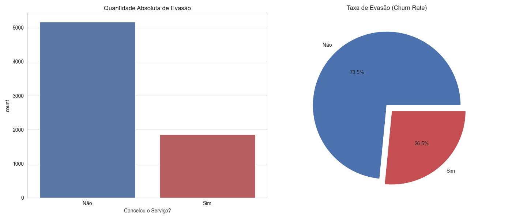
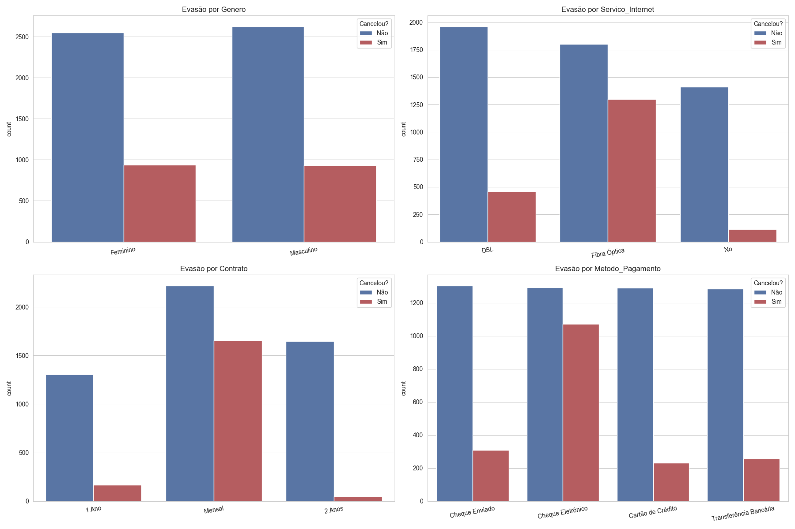
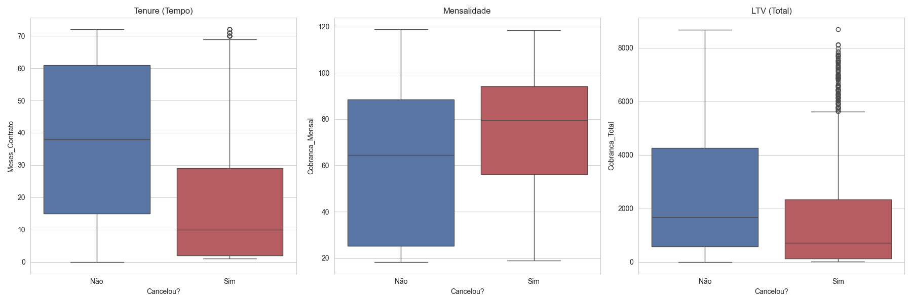
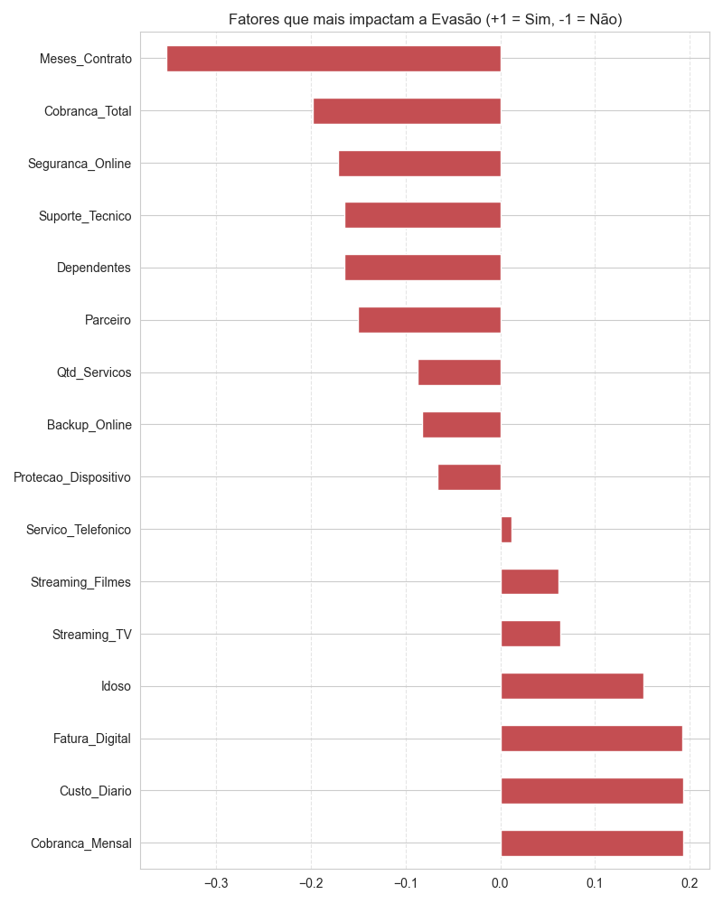
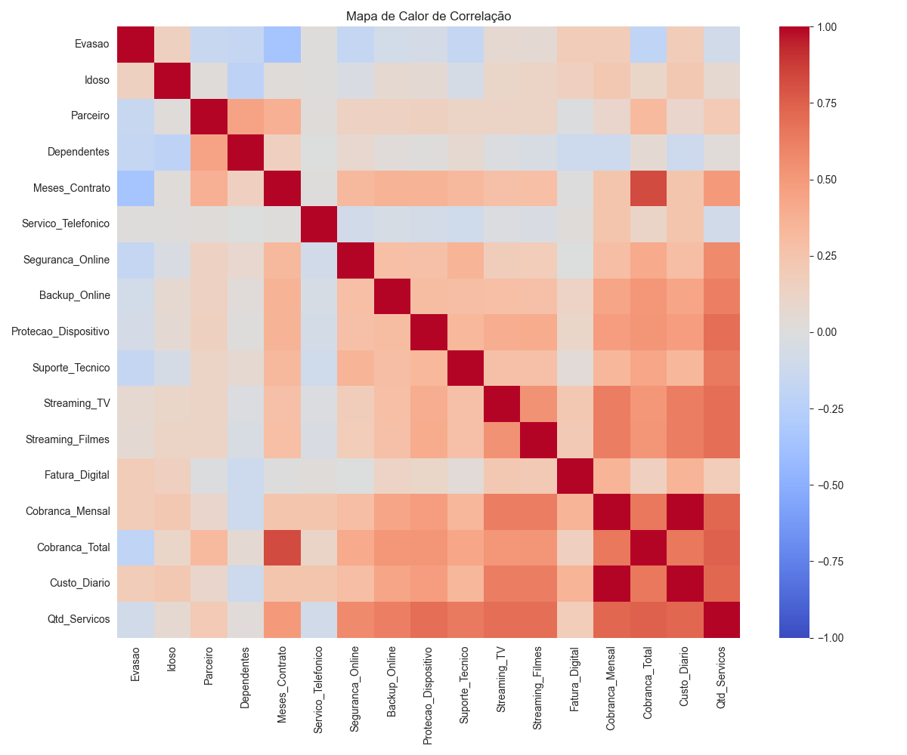

# 📡 Telecom X - Relatório de Análise de Churn

 

## 1. Visão Geral do Problema
A Telecom X enfrenta um desafio de retenção de clientes. O objetivo desta análise foi identificar os principais fatores que levam ao cancelamento (Churn) para orientar as estratégias da equipe de negócios.

### O Cenário Atual
Abaixo, visualizamos a proporção exata de clientes que cancelaram o serviço versus os que permaneceram.

*Figura 1: A taxa de evasão (Churn Rate) global da base de clientes.*

---

## 2. Perfil do Cliente de Risco
Investigamos como características contratuais e pessoais influenciam a decisão de sair. Cruzamos dados de Gênero, Internet, Contrato e Pagamento.

### Principais Descobertas:
* **Contratos Mensais:** Representam o maior volume de cancelamentos.
* **Internet:** Usuários de Fibra Óptica cancelam mais que os de DSL.
* **Pagamento:** O "Cheque Eletrônico" é o método com maior fricção/saída.

*Figura 2: Comparativo de Evasão por categorias (Contrato, Pagamento, etc).*

---

## 3. Comportamento Financeiro e Fidelidade
Analisamos se o preço (`Mensalidade`) e o tempo de casa (`Tenure`) são determinantes.

* **Tempo de Casa:** Clientes novos (poucos meses) são os mais vulneráveis.
* **Preço:** Existe uma tendência de saída em faixas de preço mais elevadas.

*Figura 3: Distribuição de mensalidades e tempo de contrato entre clientes retidos vs. evadidos.*

---

## 4. Fatores Determinantes (Estatística)
Para confirmar as hipóteses, calculamos a correlação matemática de todas as variáveis com a Evasão.

### O Que Mais Impacta o Cancelamento?
O gráfico abaixo mostra o ranking de impacto. Barras para a **direita (Positivas)** aumentam o risco de churn. Barras para a **esquerda (Negativas)** ajudam a reter o cliente.

*Figura 4: Ranking de correlação. Note como 'Contrato Mensal' puxa para o risco e 'Tenure' (tempo) puxa para a retenção.*

### Matriz de Correlação Detalhada
Visão técnica completa das relações entre todas as variáveis numéricas.

*Figura 5: Heatmap de correlações entre variáveis numéricas.*

---

## 5. Conclusão e Recomendações
Com base nos dados visuais e estatísticos, recomendamos:

1.  **Ação Imediata:** Criar campanha de migração de planos **Mensais para Anuais**, oferecendo descontos agressivos.
2.  **Onboarding:** Focar esforços de retenção nos primeiros **6 meses** do cliente (zona de risco).
3.  **Financeiro:** Incentivar a troca de "Cheque Eletrônico" por "Cartão de Crédito Automático".
